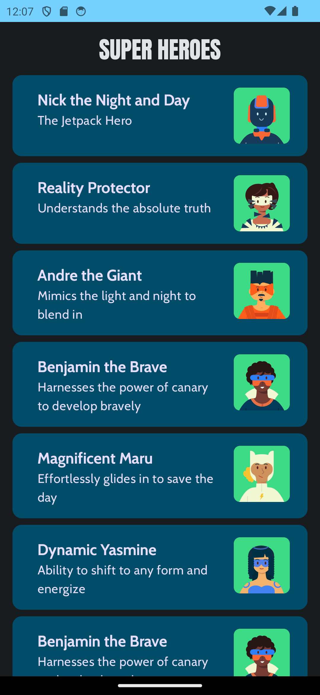
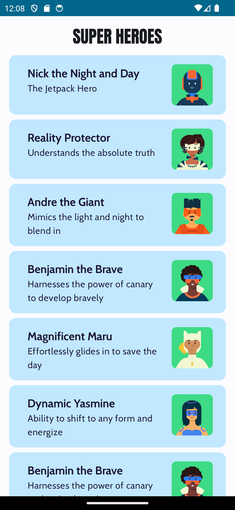

# Super Heroes

Super Heroes is an Android application built with Kotlin Jetpack Compose that displays a list of heroes. Each hero is represented as a card containing the hero's name, description, and image. The app follows Material 3 guidelines and supports both light and dark themes.

## Features

- Displays a list of heroes with their name, description, and image.
- Follows Material 3 guidelines.
- Supports light and dark themes.


## Screenshots





## Technologies Used

- Kotlin
- Jetpack Compose
- Material 3

## Setup

1. **Clone the Repository**: 
   ```
   git clone https://github.com/IbrahimAlsaudi/heroes-app.git
   ```
2. **Open in Android Studio**: 
   Open the project in Android Studio.
3. **Build and Run**: 
   Build the project and run it on an emulator or a physical device.


## Themes

The app supports both light and dark themes. You can switch between themes in the app settings.

## Contributors

- [Your Name](https://github.com/yourusername)

Feel free to contribute to this project by opening an issue or submitting a pull request!
 
